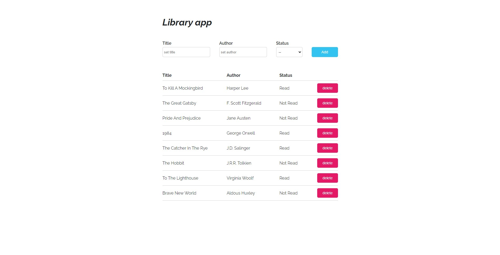

# Odin-Project-Library-app

# General Info

Simple Library app project focused on Javascript Object Constructors and storing items in LocalStorage.

# Features

- Creating list items by setting book author, title and reading status.
- Changing reading status also on existing items.
- Deleting items from the list
- Data stored on LocalStorage.

# Technologies

Built with:

- HTML
- CSS(Sass)
- Vanilla Javascript

# Inspirations & resources

The Odin Project project assignment: https://www.theodinproject.com/lessons/node-path-javascript-library

# Status

Completed. 

# Conclusions & Issues

Project strictly follows assumptions of the project but for better UX should consist functionalities:

- Sorting by each of table headings
- Editing existing positions
- Selecting multiple items for deleting

Branch "refactored_script" stores script file refactored to use classes. The app keeps the same features.

